# Movie-Genie Prototype

## Overview
Movie-Genie Prototype is a full-stack application designed to automate the creation of dynamic playlists, allowing users to browse and favorite them. Once favorited, these playlists are seamlessly added to the users' 'Liked' playlists on Trakt. This integration ensures that media library streaming services like Plex or Syncler can effortlessly display the playlists directly within their service interfaces, enhancing user experience by providing curated content with minimal effort.

[Check out the Prototype! Click Here](https://movie-genie.bassettmason.repl.co/)

## Table of Contents
- [Frontend](#frontend)
  - [Frontend Demo](#frontend-demo)
  - [Frontend Description](#frontend-description)
  - [Frontend Technologies](#frontend-technologies)
  - [Features](#features)
- [Backend](#backend)
  - [Backend Demo](#backend-demo)
  - [Backend Description](#backend-description)
  - [Components](#components)
  - [Backend Technologies](#backend-technologies)
  - [Connecting It All](#connecting-it-all)
  - [Journey Of Prototypes](#journey-of-prototypes)

## Frontend
### Frontend Demo
[youtube url goes here](#)
This video focuses on the frontend, showcasing the user interface, features, and interactions.

### Frontend Description
The frontend allows the user to log in to a Trakt.tv account, utilizing the Trakt.tv API OAuth to establish the connection.

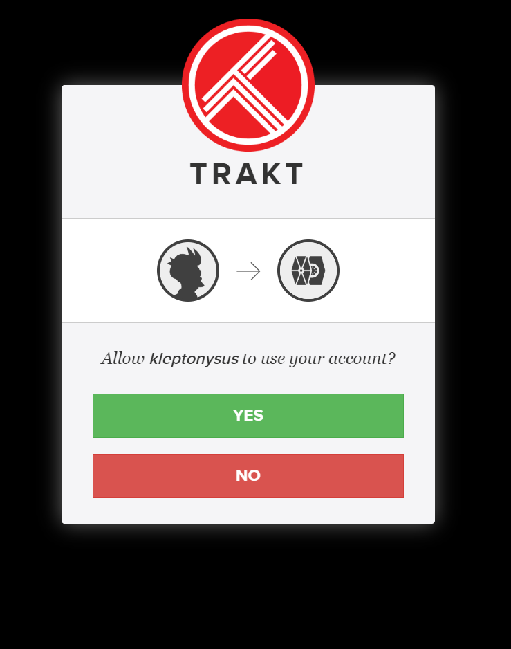
Once logged in, users can browse automated dynamic playlists and favorite them to add to their Liked playlists on Trakt.
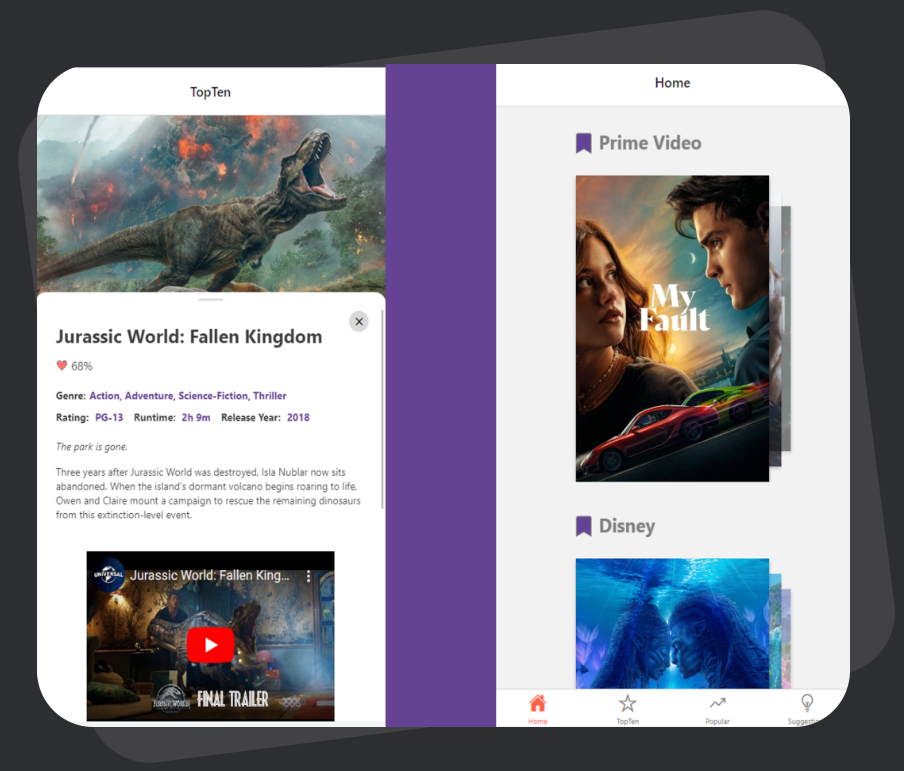
If users utilize media library streaming services such as Plex or Syncler, the playlists automatically integrate into their service GUI.

### Frontend Technologies
- **React Native**: A framework for building native apps using React.
- **Expo**: A framework and a platform for universal React applications.
- **React Navigation**: Routing and navigation for your React Native apps.
- **React Native Paper**: Material Design for React Native (Android & iOS).
- **React Native Reanimated**: A library to build high-performance animations and interactions in React Native.
- **React Native Gesture Handler**: Provides native-driven gesture management APIs for building best possible touch-based experiences.
- **React Native WebView**: A modern, well-supported WebView for React Native.
- **React Native Screens**: Provides native navigation container components.
- **Axios**: Promise-based HTTP client for the browser and Node.js.
- **Firebase**: Platform developed by Google for creating mobile and web applications.
- **Vite**: A build tool that aims to provide a faster and leaner development experience for modern web projects.
- **React Native Snap Carousel**: Swiper/carousel component for React Native featuring previews, multiple layouts, parallax images, performant handling of huge numbers of items, and more.
- **React Native Shared Element**: A performant way to make shared element transitions between screens in React Native.
- **React Native Pager View**: React Native component that allows us to swipe between different views.
- **BottomTabNavigator**: A component managing the bottom tab navigation in your app.
- **@react-native-async-storage/async-storage**: An asynchronous, unencrypted, persistent, key-value storage system for React Native.

### Features
The frontend is enriched with a variety of features designed to provide users with a diverse and enriching experience. Here are the key features currently implemented and those in the pipeline:

- **Top 10 Most Popular Movies:**
  The application showcases the top 10 most popular movies from various streaming services including Amazon, Hulu, Netflix, Disney, Paramount, and HBO, allowing users to stay updated with the trending content across platforms.

- **Upcoming Features:**
  - **Top Ten TV Shows:**
    The application is in the process of integrating a feature to display the top ten TV shows from the aforementioned streaming services, providing a balanced view of both movies and TV shows.
  
  - **Top 100 Popular Movies and TV Shows:**
    Users will soon be able to explore the top 100 popular movies and TV shows, filtered and organized by country, genre, and ratings from renowned services such as IMDB, Rotten Tomatoes, and Trakt.tv.
  
  - **AI-Sorted and Scraped Playlists:**
    The application is working towards generating AI-sorted and scraped playlists from this month's popular movie playlists from subreddits such as r/moviesuggestions. This feature will leverage AI to curate playlists from popular articles, blogs, and YouTube playlist recommendation videos, offering users a diverse range of content to explore.

- **User-Centric Recommendations:**
  The application is designed to evolve and adapt, with plans to incorporate AI-driven features that will be able to generate playlists and recommendations from various sources, ensuring that the users have access to content that aligns with their preferences and viewing habits.

## Backend
### Backend Demo
[youtube url goes here](#)
This video focuses on the backend, illustrating the components, data flow, and functionality.

### Backend Description
The backend is designed with a multitude of event-based components hosted on GCP, designed to meticulously collect, utilize, and update data.
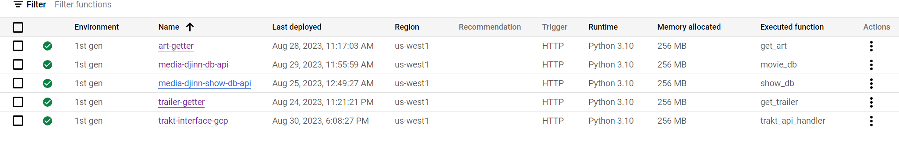
For effective data management, Firestore NoSQL DB and the Admin Trakt.tv account are employed, ensuring seamless and organized handling of data.
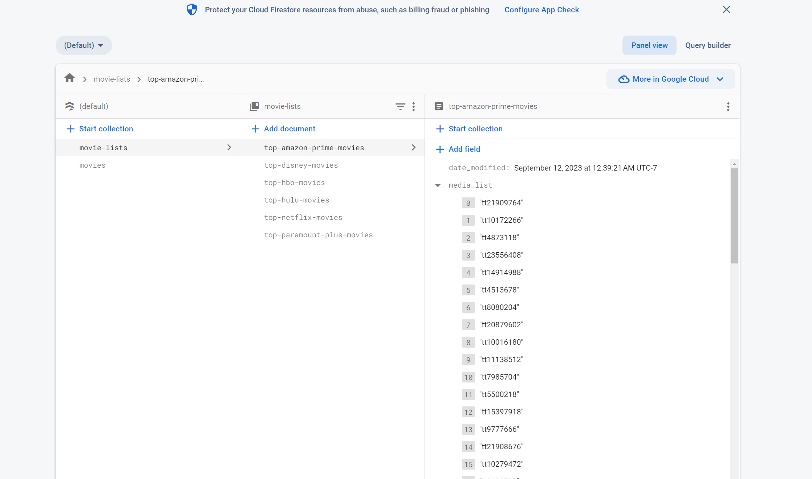
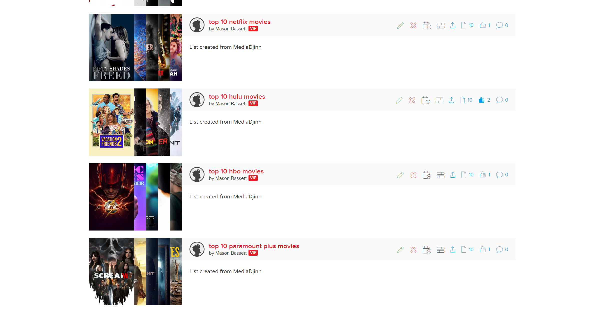

### Components
The backend is structured with several distinct components, each designed to fulfill a specific role, ensuring seamless operation and interaction within the backend to collect and utilize data through various services, APIs, and database systems.

- **flixFireScraper:**
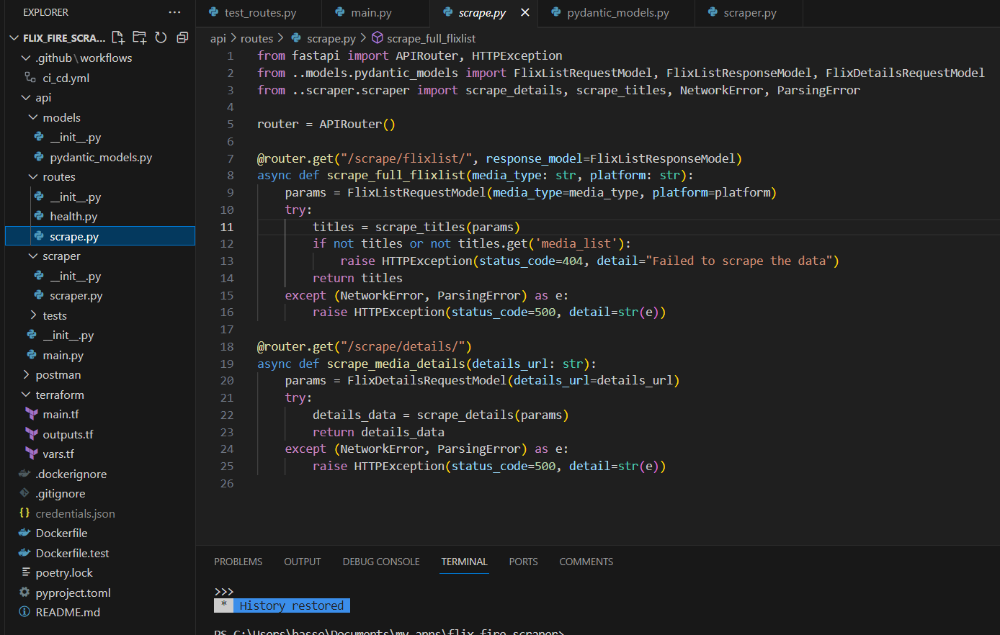
  [flixFireScraper (GitHub Repo)](https://github.com/bassettmason/flix_fire_scraper)
  This component is pivotal for scraping movie data, interacting with various movie databases and services to aggregate essential information about movies, such as titles, genres, ratings, and other pertinent details.

- **TraktInterface-GCP:**
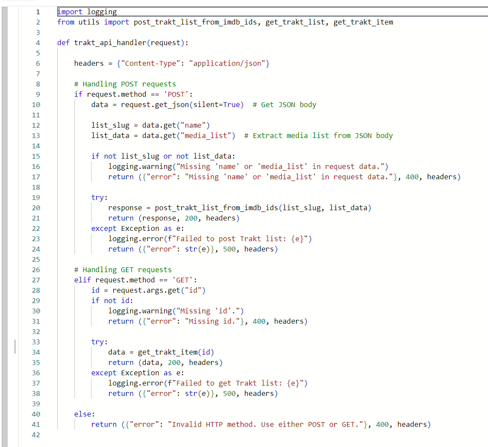
  [TraktInterface-GCP (GitHub Repo)](https://github.com/bassettmason/trakt-interface-gcp)
  Acting as the intermediary between the application and Trakt.tv, this component manages communication, data exchange, and interactions with the Trakt.tv API. It enables the application to retrieve, update, and manage user data and playlists on Trakt.tv efficiently.

- **artGetter:**
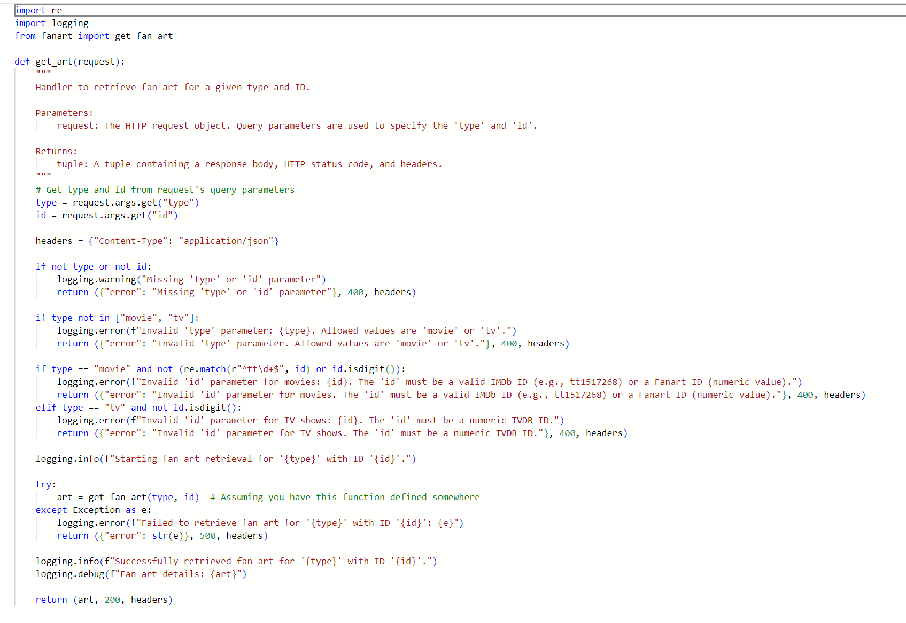
  [artGetter (GitHub Repo)](https://github.com/bassettmason/art-grabber)
  The artGetter component specializes in procuring artwork and media related to movies. It retrieves posters, banners, and other visual elements to augment the user interface and enhance user experience by delivering visually compelling and informative content.

- **TrailerGetter:**
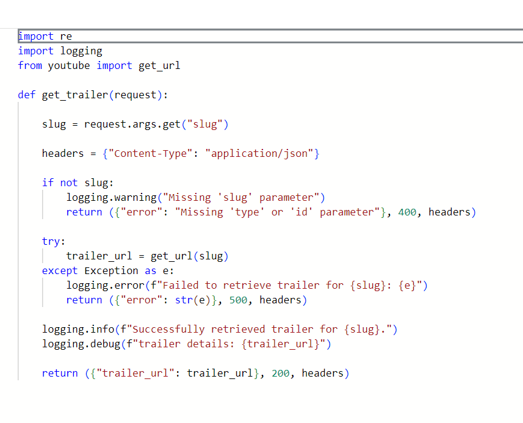
  [TrailerGetter (GitHub Repo)](https://github.com/bassettmason/trailer-grabber)
  This component is dedicated to fetching trailers and related video content for movies. It ensures users have access to trailers and previews, aiding them in exploring and discovering movies more comprehensively.

- **Media-Djinn-DB-API:**
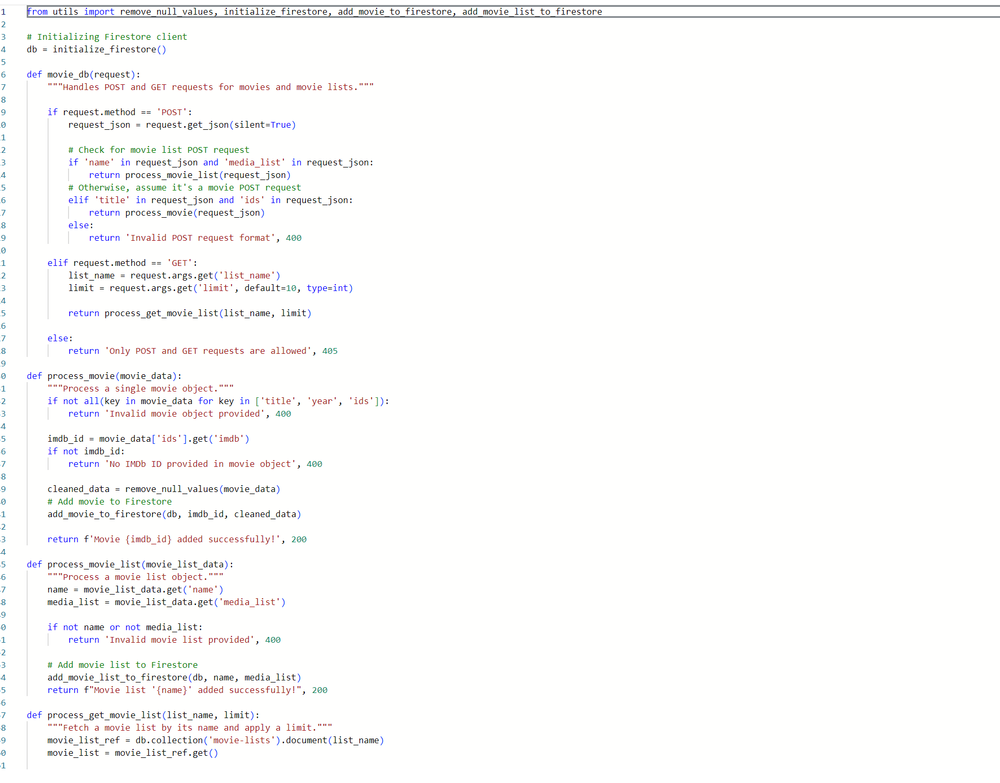
  [Media-Djinn-DB-API (GitHub Repo)](https://github.com/bassettmason/media_djinn_db_api)
  This component oversees interactions with the Firestore NoSQL DB, executing CRUD (Create, Read, Update, Delete) operations to ensure the application consistently has access to current and accurate movie data.

- **Google WorkFlows with Scheduler:**
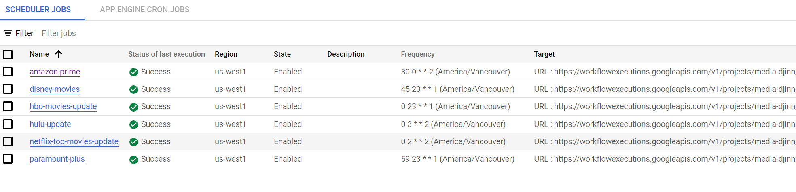
  This component orchestrates the execution of various tasks and operations within the backend. It leverages Google Scheduler to automate and schedule tasks, ensuring components like flixFireScraper and TraktInterface-GCP operate at specified intervals to maintain data freshness and synchronization.

Each component is integral in sustaining the integrity, accuracy, and responsiveness of the application, collaboratively operating within an event-based architecture to deliver a seamless and enriching user experience.

### Backend Technologies
The backend leverages a diverse array of technologies, libraries, and services to facilitate efficient data processing, retrieval, and management. Below are the key technologies employed:

- **FastAPI:**
  A modern, high-performance web framework for building APIs with Python, based on standard Python type hints.

- **Pydantic:**
  Utilized for data validation and settings management using Python type annotations.

- **Firestore:**
  A flexible and scalable NoSQL cloud database designed to store and synchronize data for client- and server-side development.

- **BeautifulSoup:**
  A Python library that excels in extracting data from HTML and XML files, offering Pythonic idioms for iterating, searching, and modifying the parse tree.

- **Requests:**
  A user-friendly HTTP library for Python.

- **Google Cloud Functions:**
  A lightweight, event-based, asynchronous compute solution enabling the creation of small, single-purpose functions that respond to cloud events without the necessity to manage a server or runtime environment.

- **Google Scheduler:**
  A fully managed, enterprise-grade cron job scheduler, enabling the execution of jobs on any schedule.

- **Google Cloud Run:**
  A fully managed compute platform that automatically scales stateless containers.

- **GitHub Actions:**
  Facilitates CI/CD and allows the automation of workflows directly within GitHub repositories.

- **Terraform:**
  An open-source infrastructure as code software tool, providing a consistent CLI workflow to manage a multitude of cloud services.

- **GCP (Google Cloud Platform):**
  A suite of cloud computing services running on the same infrastructure that Google uses for its end-user products.

- **Docker:**
  A platform designed for developing, shipping, and running applications in containers.

- **Google Workflows:**
  A fully managed service for orchestrating Google Cloud and HTTP-based APIs, integrating with various Google Cloud services and any publicly available APIs.

- **Pytest:**
  A testing framework that simplifies the process of writing simple tests and scales to support complex functional testing for applications.

- **Uvicorn:**
  A lightning-fast ASGI server implementation, utilizing uvloop and httptools.

- **Postman:**
  A collaboration platform for API development, widely used for testing APIs.

- **Fanart API:**
  An API specialized in retrieving artwork, images, and other media-related content.

- **YouTube API:**
  Facilitates interactions with YouTube services to retrieve video content, details, and other media-related information.

- **Trakt.tv API:**
  Offers interfaces to interact with Trakt.tv services to manage and retrieve user data and playlists.

- **Premium Flix Account API:**
  An API designed to interact with Premium Flix services for accessing premium data.

Each technology is integral in ensuring the backend is robust, scalable, and efficient, meeting the diverse needs of the application.

## Connecting It All
- Utilizing event-based architecture on GCP enables modular functioning of each component and feature. This allows for easy debugging and seamless addition of new features. Instead of a gateway server to interconnect everything, I employ Google Workflows, which are YAML orchestrated scheduled functions.
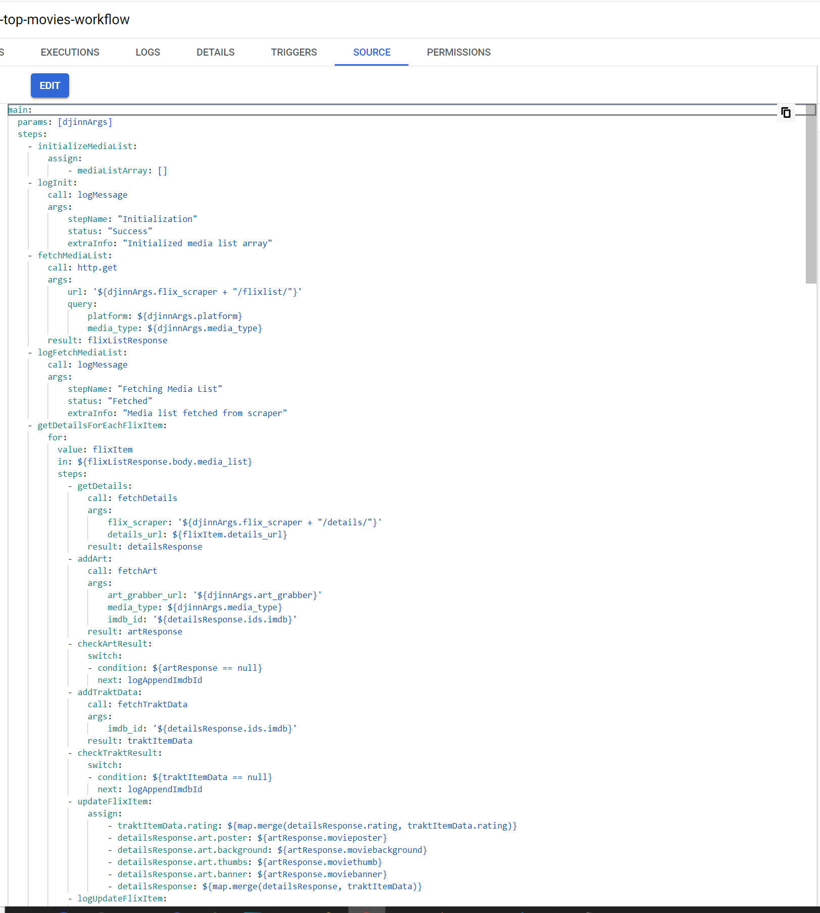
- Fortunately, Workflows provide an image layout feature for easy visual representation, allowing a clear overview of how all components are interconnected.
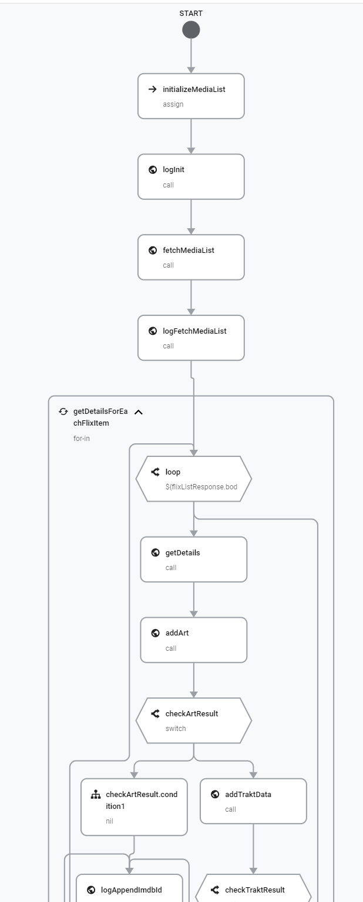

  
## Journey Of Prototypes
- The creation of the back-end was a comprehensive learning journey, involving experimentation with and learning about different architectural methods.
- An online IDE named Repl was used to create the original prototypes. This means many of the commits and progress of this app are not visible on my GitHub.
- The first prototype utilized a PostgreSQL DB with SQL Alchemy and Flask.
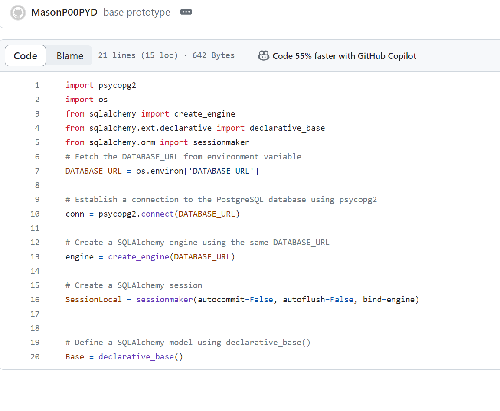
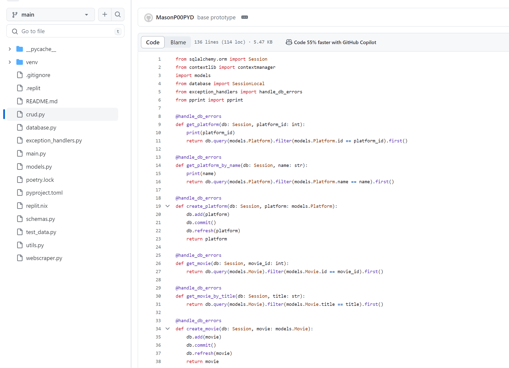
- While developing my CI/CD pipeline, considering costs, and testing speed, I decided to migrate the entire system to a new architecture.
  - Migrated from Flask to FastAPI for a more modern and faster web framework.
  - Switched from PostgreSQL to Firestore for a more flexible and scalable NoSQL cloud database.
  - Transitioned from one monolithic API to a more modular, event-based system using GCP, allowing for more efficient and scalable interactions.

